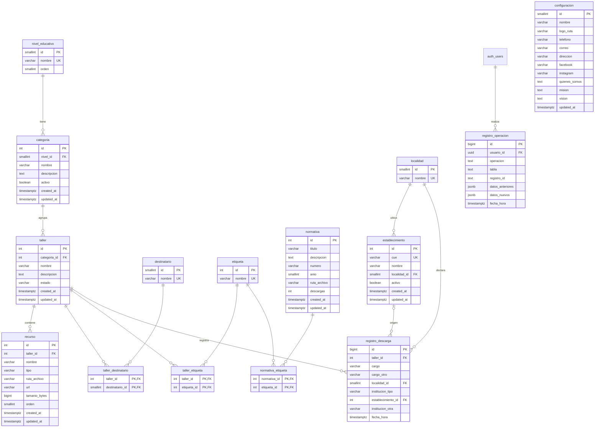

# Sistema de Gestión de Activos Digitales (DAM)

## Documento de Definición del Sistema

| | |
|---|---|
| **Organismo** | Ministerio de Educación de la Provincia de Misiones |
| **Marco** | Práctica Profesional Supervisada — Ingeniería en Sistemas de Información |
| **Institución académica** | Universidad de la Cuenca del Plata, Sede Posadas |
| **Autor** | Joaquín Sebastián Sánchez |
| **Versión** | 2 — Octubre de 2026 (v1: septiembre de 2026) |

---

## Registro de cambios

| Versión | Cambio | Decisión |
|---|---|---|
| 2 | Se elimina la API propia (Express, Docker, monorepo). El frontend usa Supabase directo con RLS y Edge Functions. | [0004](decisiones/0004-supabase-directo-sin-api-propia.md) |
| 2 | Un usuario de Supabase Auth por persona, con rol único. Se eliminan la cuenta compartida, `sesion_responsable` y la declaración del responsable. Auditoría por `auth.uid()` con trigger genérico. | [0005](decisiones/0005-usuario-por-persona-y-auditoria.md) |
| 2 | Descarga: un formulario por taller y luego un enlace por recurso. Resuelve P-05. | [0006](decisiones/0006-descarga-formulario-y-enlaces.md) |
| 2 | Normativas y configuración institucional entran al alcance. | [0007](decisiones/0007-normativas-y-configuracion.md) |
| 2 | Cinco niveles educativos fijos. Sin talleres multinivel. | [0008](decisiones/0008-niveles-educativos.md) |
| 2 | Recursos de tipo enlace para videos. | [0009](decisiones/0009-videos-como-enlace.md) |
| 2 | Padrón de establecimientos y nuevo formulario de descarga (cargo, localidad, institución). Responde C-01. | [0010](decisiones/0010-padron-de-establecimientos.md) |
| 2 | Supabase local con Docker-in-Docker para desarrollo. | [0011](decisiones/0011-supabase-local-docker-in-docker.md) |
| 2 | Búsqueda en el cliente, reglas de baja y unicidad, tablero de métricas (secciones 5.3, 5.4 y 8.4). | — |

Este documento describe **qué** hace el sistema. El **por qué** de cada decisión está en `docs/decisiones/`
y el **estado actual del código** en `docs/arquitectura.md`.

---

## Índice

1. Introducción
2. Descripción general del sistema
3. Usuarios del sistema
4. Modelo de contenido
5. Funcionalidades
6. Criterios de calidad
7. Estructura de navegación
8. Modelo de datos
9. Arquitectura y tecnologías
10. Restricciones y consideraciones
11. Consultas
12. Temas pendientes de definición

---

## 1. Introducción

### 1.1 Propósito del documento

Este documento reúne la definición funcional del Sistema de Gestión de Activos Digitales (DAM) del Ministerio de Educación de Misiones. Su finalidad es servir como referencia común para el equipo de desarrollo y el referente del Ministerio, y registrar las decisiones tomadas y los temas que aún requieren definición.

### 1.2 Alcance

El sistema comprende:

- un portal público, de acceso libre, para la consulta y descarga de los recursos de los talleres y de las normativas;
- un panel de administración, de acceso restringido, para la gestión del catálogo, las normativas, el padrón de establecimientos y la configuración institucional, y para la consulta de métricas de uso.

### 1.3 Definiciones y siglas

| Término | Definición |
|---|---|
| **DAM** | *Digital Asset Management*. Sistema de gestión de activos digitales. |
| **Recurso** | Archivo digital (PDF, presentación, documento, imagen, video) o enlace externo (por ejemplo, un video de YouTube) que forma parte de un taller. |
| **Taller** | Propuesta educativa concreta, compuesta por uno o más recursos. |
| **Categoría** | Eje temático que agrupa talleres dentro de un nivel educativo. |
| **Destinatario** | Público al que va dirigido un taller. |
| **Etiqueta** | Palabra clave que describe el contenido de un taller o normativa y facilita su búsqueda. |
| **Normativa** | Resolución o norma del Ministerio, con número, año y archivo, disponible en el portal. |
| **Establecimiento** | Institución educativa registrada en el padrón del sistema. |
| **Padrón** | Listado de establecimientos de la provincia, provisto por el Ministerio. |
| **CUE** | Código Único de Establecimiento. |
| **RLS** | *Row Level Security*. Políticas de PostgreSQL que definen qué filas puede leer o modificar cada usuario. |
| **Edge Function** | Función de servidor alojada en Supabase, usada para las operaciones que requieren la clave de servicio. |
| **WCAG** | *Web Content Accessibility Guidelines*. Pautas de accesibilidad para el contenido web. |

---

## 2. Descripción general del sistema

### 2.1 Contexto

El Ministerio de Educación de Misiones ofrece a las instituciones educativas de los niveles inicial, primario, secundario, terciario y de formación profesional distintos recursos educativos, como programas y talleres sobre temáticas específicas. Un ejemplo es el material para la prevención del consumo de alcohol.

### 2.2 Problemática

Actualmente, cada establecimiento que necesita un recurso debe solicitarlo individualmente al Ministerio. Esto provoca:

- demoras en el acceso a los materiales por parte de las instituciones;
- una carga administrativa recurrente para el personal que atiende cada pedido;
- la ausencia de un punto centralizado donde consultar los recursos disponibles.

### 2.3 Objetivo general

Diseñar y desarrollar un sistema web que centralice, organice y facilite el acceso a los recursos educativos del Ministerio, de modo que las instituciones puedan consultarlos y descargarlos directamente, sin necesidad de realizar una solicitud individual.

### 2.4 Objetivos específicos

- Organizar los recursos en un catálogo estructurado por nivel educativo, categoría y taller.
- Permitir la consulta y descarga de recursos y normativas sin necesidad de registro por parte de las instituciones.
- Registrar cada descarga de un taller, identificando el establecimiento a partir de un padrón, para obtener información confiable sobre el uso de los recursos.
- Proveer un panel de administración para la gestión del catálogo, las normativas, el padrón y la configuración institucional.
- Ofrecer un tablero de métricas que asista al Ministerio en la toma de decisiones.

### 2.5 Tipo de sistema

El sistema es un **DAM (Digital Asset Management)**: su función es almacenar, catalogar y distribuir los archivos que componen los talleres del Ministerio. Se trata de una aplicación web compuesta por dos componentes:

| Componente | Usuarios | Acceso |
|---|---|---|
| Portal público de consulta y descarga | Instituciones educativas | Libre, sin autenticación |
| Panel de administración | Personal del Ministerio | Restringido, con una cuenta por persona |

Desde el punto de vista de los sistemas de información, el DAM integra:

- **Gestión de contenidos:** alta, modificación y baja de categorías, talleres, recursos y normativas, junto con sus archivos.
- **Información para la gestión:** el registro de descargas, vinculado al padrón de establecimientos, alimenta un tablero de métricas que permite conocer la demanda de cada recurso y la cobertura territorial.

---

## 3. Usuarios del sistema

### 3.1 Institución educativa

| Aspecto | Descripción |
|---|---|
| Autenticación | No posee cuenta ni inicia sesión. |
| Acceso | Navega libremente el catálogo de talleres y las normativas. |
| Descarga de un taller | Al presionar "Descargar" completa un único formulario con cargo, localidad e institución. Luego obtiene la lista de los recursos del taller, cada uno con su enlace de descarga. |
| Descarga de una normativa | Directa, sin formulario. |

### 3.2 Administrador

| Aspecto | Descripción |
|---|---|
| Autenticación | Cada persona del Ministerio tiene su propia cuenta de Supabase Auth. |
| Rol | Único. Todos los administradores pueden realizar todas las operaciones (pedido del referente). |
| Gestión | Administra categorías, talleres, recursos, normativas, etiquetas, el padrón de establecimientos y la configuración institucional. |
| Trazabilidad | Cada operación queda registrada automáticamente a nombre del usuario autenticado. |
| Usuarios | Las primeras cuentas se crean desde Supabase. Más adelante, cualquier administrador podrá invitar y desactivar usuarios desde el panel (feature posterior). |
| Métricas | Consulta el tablero de métricas. |

---

## 4. Modelo de contenido

El catálogo de talleres se organiza en cuatro niveles:

```
Nivel educativo
└── Categoría
    └── Taller
        └── Recursos (archivos o enlaces)
```

| Elemento | Descripción | Ejemplo |
|---|---|---|
| Nivel educativo | Inicial, Primario, Secundario, Terciario o Formación profesional | Secundario |
| Categoría | Eje temático dentro de un nivel | Salud mental |
| Taller | Propuesta concreta dentro de una categoría. Pertenece a un solo nivel. | Cuidados en redes sociales |
| Recurso | Archivo o enlace que forma parte del taller | PDF, PPTX, video de YouTube |

Las **normativas** forman un catálogo aparte, sin jerarquía, organizado por número, año y etiquetas.

---

## 5. Funcionalidades

### 5.1 Portal público

| Funcionalidad | Descripción |
|---|---|
| Navegación del catálogo | Permite recorrer los talleres organizados por nivel educativo y categoría. |
| Búsqueda por texto y etiquetas | Busca palabras clave en el nombre, la descripción y las etiquetas de cada taller, sin distinguir mayúsculas ni tildes. |
| Filtro por nivel educativo | Muestra solo los talleres del nivel seleccionado. |
| Filtro por destinatario | Muestra solo los talleres dirigidos al público seleccionado. |
| Detalle del taller | Presenta la información del taller y el listado de sus recursos, con tipo y tamaño. Los videos enlazados se reproducen integrados en la página. |
| Descarga del taller | El botón "Descargar" abre un formulario (cargo, localidad, institución). Al enviarlo se registra la descarga y se muestra la lista de recursos con sus enlaces y el tamaño total. El formulario se recuerda durante la visita. |
| Normativas | Listado con búsqueda por título, número y etiquetas, y descarga directa. |

La búsqueda y los filtros pueden combinarse entre sí. El portal muestra solo talleres publicados.

**Formulario de descarga**

| Campo | Comportamiento |
|---|---|
| Cargo | Lista: Director/a, Vicedirector/a, Secretario/a, Docente, Supervisor/a, Otro. "Otro" habilita un campo de texto obligatorio. |
| Localidad | Lista de municipios de Misiones. |
| Institución | Lista de establecimientos del padrón, filtrada por la localidad elegida. Incluye "Otra" (habilita un campo de texto obligatorio) y "Sin institución" (por ejemplo, supervisores). |

### 5.2 Panel de administración

| Funcionalidad | Descripción |
|---|---|
| Inicio de sesión | Cada persona ingresa con su cuenta. Incluye recuperación de contraseña por correo. |
| Cierre por inactividad | Cierra la sesión después de 30 minutos sin actividad, para computadoras compartidas. |
| Gestión de categorías | Alta, modificación y baja de las categorías de cada nivel educativo. |
| Gestión de talleres | Alta, modificación y baja de talleres, incluyendo destinatarios y etiquetas. Cada taller puede estar en borrador, publicado o inactivo. |
| Gestión de recursos | Carga, reemplazo y eliminación de los archivos y enlaces de cada taller. |
| Gestión de etiquetas | Al escribir una etiqueta, el sistema sugiere las existentes para evitar duplicados; si no existe, se agrega a la lista. Compartidas entre talleres y normativas. |
| Gestión de normativas | Alta, modificación y baja de normativas con su archivo. |
| Padrón de establecimientos | Alta, modificación y baja de establecimientos. La carga inicial la realiza el equipo de desarrollo. |
| Instituciones sin vincular | Lista los nombres ingresados como "Otra", agrupados y con su cantidad de descargas. Permite crear un establecimiento nuevo o vincularlos a uno existente. |
| Configuración institucional | Edición de nombre, logo, misión, visión, quiénes somos, datos de contacto y redes sociales. |
| Historial de operaciones | Registro automático de cada alta, modificación y baja sobre las entidades gestionables, a nombre del usuario. Pantalla de solo lectura con filtros por fecha, usuario y tipo de entidad. |
| Tablero de métricas | Ver sección 5.4. |
| Gestión de usuarios *(posterior)* | Invitar usuarios por correo y desactivarlos. No se puede desactivar a uno mismo ni al último administrador activo. |

### 5.3 Reglas de gestión

| Regla | Descripción |
|---|---|
| Estados del taller | **Borrador** (en preparación, no visible), **Publicado** (visible) o **Inactivo** (dado de baja, no visible). El portal muestra solo los publicados. |
| Baja de categorías | No se puede dar de baja una categoría que tenga talleres en estado distinto de Inactivo. El sistema informa cuántos tiene. |
| Baja de talleres | El taller pasa a Inactivo y se oculta del portal junto con sus recursos. Se conservan sus descargas. |
| Baja de recursos | Eliminación física, en la base y en Storage. El reemplazo sube el archivo nuevo y elimina el anterior. |
| Baja de establecimientos | Lógica: dejan de ofrecerse en el formulario, pero se conservan sus descargas. |
| Formatos admitidos | PDF, PPTX, DOCX, imágenes y MP4 como archivo; videos también como enlace a YouTube (recomendado). |
| Tamaño máximo | 50 MB por archivo. |
| Unicidad | Etiquetas, destinatarios y localidades no se repiten aunque difieran en mayúsculas o tildes. Las categorías no se repiten dentro de su nivel. El CUE, cuando existe, es único. |

### 5.4 Tablero de métricas

Propuesta inicial, a validar con el referente (P-03). Todos los indicadores se calculan en la base de datos y admiten un **filtro de período** (últimos 30 días, año en curso o rango).

| Indicador | Uso |
|---|---|
| Descargas totales, talleres publicados, normativas publicadas, establecimientos alcanzados | Resumen general. |
| Descargas en el tiempo | Tendencia y efecto de las difusiones. |
| Ranking de talleres más descargados | Qué material tiene más demanda. |
| Descargas por nivel y por cargo (cantidad y porcentaje) | Quién usa el sistema. |
| Descargas y cobertura por localidad (establecimientos alcanzados ÷ establecimientos del padrón) | Dónde no está llegando el material. Diez principales, con opción de ver todas. |
| Instituciones sin vincular | Aviso con enlace a la pantalla correspondiente. |
| Descargas de normativas | Contador por normativa. |

---

## 6. Criterios de calidad

El sistema se desarrollará respetando las pautas de accesibilidad **WCAG 2.2**, con el nivel AA como objetivo, de modo que pueda ser utilizado por personas con distintas capacidades y mediante distintas formas de navegación, como el teclado o los lectores de pantalla. La interfaz se diseñará siguiendo buenas prácticas de **UX/UI**: será simple, clara y consistente, pensada para usuarios con distintos niveles de manejo informático. Además, tendrá un **diseño responsivo** que se adapte a computadoras, tablets y celulares, priorizando el uso desde el celular en el portal público.

---

## 7. Estructura de navegación

El portal se recorre sin iniciar sesión; el login solo es necesario para acceder al panel de administración.

| Sección | Acceso | Contenido |
|---|---|---|
| Home | Público | Misión, visión y quiénes somos, tomados de la configuración institucional. |
| Talleres | Público | Catálogo, búsqueda, filtros, detalle de talleres y descarga de recursos. |
| Normativas | Público | Listado, búsqueda y descarga directa. |
| Contacto | Público | Correo, teléfono, dirección y redes. Sin formulario. |
| Login | Público | Inicio de sesión del administrador, accesible desde la esquina superior de la barra de navegación. |
| Panel de administración | Privado | Gestión, historial y tablero de métricas. |

### 7.1 Panel de administración

- Dashboard (tablero de métricas).
- Talleres: niveles → categorías → talleres → recursos.
- Normativas.
- Establecimientos e instituciones sin vincular.
- Historial de operaciones.
- Configuración institucional.
- Usuarios *(feature posterior)*.

---

## 8. Modelo de datos

### 8.1 Diagrama entidad-relación (DER)



`auth_users` representa la tabla `auth.users` de Supabase Auth, que no forma parte del esquema propio.

### 8.2 Resumen de entidades

| Entidad | Descripción |
|---|---|
| nivel_educativo | Catálogo fijo: Inicial, Primario, Secundario, Terciario y Formación profesional. |
| categoria | Eje temático perteneciente a un nivel educativo. |
| taller | Propuesta educativa perteneciente a una categoría. |
| recurso | Archivo o enlace que forma parte de un taller. |
| destinatario / taller_destinatario | Públicos de un taller (muchos a muchos). |
| etiqueta / taller_etiqueta / normativa_etiqueta | Palabras clave compartidas por talleres y normativas. |
| normativa | Resolución o norma con su archivo y su contador de descargas. |
| localidad | Municipios de la provincia. |
| establecimiento | Padrón de establecimientos educativos. |
| registro_descarga | Cada descarga de un taller realizada desde el portal. |
| registro_operacion | Auditoría de las operaciones del panel. |
| configuracion | Datos institucionales del sitio (una sola fila). |

### 8.3 Diccionario de datos

Las columnas `created_at` y `updated_at` (timestamptz, NOT NULL) se omiten en las tablas siguientes.

**Criterio enum vs. CHECK.** Una lista cerrada que el frontend usa como tipo es un `enum` de Postgres (`db:types` genera la unión,
sin escribirla a mano): `taller.estado` es el enum `estado_taller`. Una lista con "Otro" o que se valida contra texto libre es un
`varchar` con `CHECK` (por ejemplo `cargo`). Donde esta tabla diga `varchar` para una lista cerrada, se aplica este criterio al
migrar su dominio.

**nivel_educativo**

| Campo | Tipo | Restricciones | Descripción |
|---|---|---|---|
| id | smallint | PK | Identificador. |
| nombre | varchar(50) | NOT NULL, UNIQUE | Nombre del nivel. |
| orden | smallint | NOT NULL | Orden de presentación. |

**categoria**

| Campo | Tipo | Restricciones | Descripción |
|---|---|---|---|
| id | int | PK | Identificador. |
| nivel_id | smallint | FK → nivel_educativo, NOT NULL | Nivel al que pertenece. |
| nombre | varchar(150) | NOT NULL, único normalizado por nivel | Nombre de la categoría. |
| descripcion | text | | Descripción opcional. |
| activo | boolean | NOT NULL, por defecto verdadero | Baja lógica. |

**taller**

| Campo | Tipo | Restricciones | Descripción |
|---|---|---|---|
| id | int | PK | Identificador. |
| categoria_id | int | FK → categoria, NOT NULL | Categoría a la que pertenece. Determina el nivel. |
| nombre | varchar(200) | NOT NULL | Nombre del taller. |
| descripcion | text | NOT NULL | Descripción. Se utiliza en la búsqueda. |
| estado | enum `estado_taller` | NOT NULL, por defecto BORRADOR | BORRADOR, PUBLICADO o INACTIVO. |

**recurso**

| Campo | Tipo | Restricciones | Descripción |
|---|---|---|---|
| id | int | PK | Identificador. |
| taller_id | int | FK → taller, NOT NULL | Taller al que pertenece. |
| nombre | varchar(200) | NOT NULL | Nombre visible. |
| tipo | varchar(20) | NOT NULL | PDF, PPTX, DOCX, IMAGEN, VIDEO o ENLACE. Define el ícono. |
| ruta_archivo | varchar(500) | | Ubicación en el bucket privado. Obligatoria salvo en ENLACE. |
| url | varchar(500) | | Dirección externa. Obligatoria solo en ENLACE. |
| tamanio_bytes | bigint | | Tamaño del archivo; nulo en ENLACE. |
| orden | smallint | NOT NULL | Orden dentro del taller. |

CHECK: `(tipo = 'ENLACE') = (url IS NOT NULL AND ruta_archivo IS NULL)` y, si no es ENLACE, `ruta_archivo` y `tamanio_bytes` no nulos.

**destinatario** y **etiqueta**

| Campo | Tipo | Restricciones | Descripción |
|---|---|---|---|
| id | smallint / int | PK | Identificador. |
| nombre | varchar(100) | NOT NULL, único normalizado | Nombre del destinatario o de la etiqueta. |

**taller_destinatario**, **taller_etiqueta** y **normativa_etiqueta**: clave primaria compuesta por las dos claves foráneas.

**normativa**

| Campo | Tipo | Restricciones | Descripción |
|---|---|---|---|
| id | int | PK | Identificador. |
| titulo | varchar(200) | NOT NULL | Título. |
| descripcion | text | | Descripción. |
| numero | varchar(50) | NOT NULL | Número de la resolución. |
| anio | smallint | NOT NULL | Año. |
| ruta_archivo | varchar(500) | NOT NULL | Ubicación en el bucket público de normativas. |
| descargas | int | NOT NULL, por defecto 0 | Contador anónimo, incrementado por una función RPC. |

**localidad**

| Campo | Tipo | Restricciones | Descripción |
|---|---|---|---|
| id | smallint | PK | Identificador. |
| nombre | varchar(100) | NOT NULL, único normalizado | Nombre del municipio. |

**establecimiento**

| Campo | Tipo | Restricciones | Descripción |
|---|---|---|---|
| id | int | PK | Identificador. |
| cue | varchar(20) | UNIQUE, opcional | Código Único de Establecimiento, cuando se conoce. |
| nombre | varchar(200) | NOT NULL | Nombre del establecimiento. No es único (puede repetirse entre localidades). |
| localidad_id | smallint | FK → localidad, NOT NULL | Localidad. |
| activo | boolean | NOT NULL, por defecto verdadero | Baja lógica. |

**registro_descarga**

| Campo | Tipo | Restricciones | Descripción |
|---|---|---|---|
| id | bigint | PK | Identificador. |
| taller_id | int | FK → taller, NOT NULL | Taller descargado. |
| cargo | varchar(30) | NOT NULL, CHECK sobre la lista de cargos | Cargo declarado. |
| cargo_otro | varchar(100) | Obligatorio solo si cargo = 'Otro' | Cargo escrito. |
| localidad_id | smallint | FK → localidad, NOT NULL | Localidad declarada (dato histórico). |
| institucion_tipo | varchar(20) | NOT NULL | PADRON, OTRA o SIN_INSTITUCION. |
| establecimiento_id | int | FK → establecimiento | Obligatorio en PADRON; en OTRA se completa al vincular. |
| institucion_otra | varchar(200) | Obligatorio solo en OTRA | Nombre escrito; se conserva al vincular. |
| fecha_hora | timestamptz | NOT NULL | Momento de la descarga. |

**registro_operacion**

| Campo | Tipo | Restricciones | Descripción |
|---|---|---|---|
| id | bigint | PK | Identificador. |
| usuario_id | uuid | FK → auth.users | Usuario autenticado (`auth.uid()`). NULL = operación del sistema (sin sesión). |
| operacion | text | NOT NULL, CHECK | INSERT, UPDATE o DELETE. |
| tabla | text | NOT NULL | Tabla afectada (nombre sin esquema). |
| registro_id | text | | Identificador del registro afectado. NULL en tablas sin columna `id` (clave compuesta); la clave queda en `datos_anteriores` / `datos_nuevos`. |
| datos_anteriores / datos_nuevos | jsonb | | Estado antes y después de la operación. |
| fecha_hora | timestamptz | NOT NULL | Momento de la operación. |

La auditoría falla cerrada (§9.1): si el trigger `auditar()` no puede registrar la operación, la escritura también falla. La tabla es append-only: ningún rol de la API escribe en ella, solo el trigger.

**configuracion**: una sola fila (`CHECK (id = 1)`) con los campos del diagrama. `logo_ruta` apunta a un bucket público.

### 8.4 Decisiones de diseño

- **Una descarga por taller.** El formulario se completa una vez por taller; el registro referencia al taller, no a cada archivo. Significa "formulario completado", no "descargó todos los archivos" (0006).
- **Métricas sin datos duplicados.** Nivel y categoría se obtienen recorriendo las relaciones. Las métricas se calculan en la base, con vistas o funciones accesibles solo para administradores.
- **Hechos históricos.** `registro_descarga` guarda la localidad declarada aunque el establecimiento ya tenga una: si el establecimiento cambia, la descarga conserva lo declarado.
- **Baja lógica solo donde hay historia.** Taller, categoría y establecimiento (referenciados por descargas o talleres). Recursos, normativas y etiquetas sin uso se eliminan físicamente; los archivos también se borran de Storage.
- **Una regla de visibilidad.** Como no puede existir un taller publicado en una categoría inactiva, el portal filtra solo por `taller.estado`.
- **Catálogos con unicidad normalizada.** Índices únicos sobre `lower(unaccent(nombre))` para evitar "Salud" / "salud" / "Salúd".
- **Cargo como texto con CHECK.** Lista corta y estable; el invariante de "Otro" queda completo en la base sin depender de un identificador. Localidad y establecimiento, en cambio, son tablas.
- **Institución explícita.** `institucion_tipo` distingue padrón, otra y sin institución, para que un dato faltante por error no se confunda con una elección.
- **Recurso como archivo o enlace.** Un CHECK garantiza exactamente una de las dos ubicaciones (0009).
- **Auditoría genérica.** Un único trigger aplicado a todas las tablas gestionables guarda `auth.uid()`, la operación y el estado anterior y posterior completos (OLD/NEW). Un test global falla si una tabla de `public` no tiene el trigger. La identidad sale de la sesión autenticada, no de un dato que envía el cliente (0005).
- **Cuentas fuera del modelo propio.** Los usuarios viven en `auth.users`. Una marca `app_metadata.admin = true` distingue administradores; las políticas RLS la exigen.
- **Archivos fuera de la base.** Bucket privado para recursos de talleres (enlaces firmados), buckets públicos para normativas y logo.
- **Búsqueda en el cliente.** El catálogo publicado (cientos de talleres) se obtiene una vez y se filtra en el navegador, normalizando tildes. Si crece, se reemplaza por una función RPC sin cambiar las pantallas.

---

## 9. Arquitectura y tecnologías

### 9.1 Arquitectura

El frontend se comunica directamente con Supabase. No hay un servidor propio (0004).

```
Navegador (React, sitio estático)
      │  supabase-js (clave anon)
      ▼
Supabase
 ├── PostgreSQL     datos, reglas (constraints, triggers, RPC) y políticas RLS
 ├── Auth           una cuenta por administrador
 ├── Storage        bucket privado (talleres) y públicos (normativas, logo)
 └── Edge Functions con la clave de servicio:
       descargar-taller     valida, registra la descarga y firma los enlaces
       gestionar-usuarios   invita y desactiva usuarios (feature posterior)
```

- **Seguridad:** la clave `anon` es pública por diseño. Lo que protege los datos son las políticas RLS, activadas en **todas** las tablas y verificadas con tests. La clave de servicio solo existe en las Edge Functions.
- **Reglas de negocio en la base:** las reglas de baja, los invariantes y la auditoría se cumplen sin importar desde dónde llegue el cambio.

### 9.2 Tecnologías

| Capa | Tecnología | Función | Estado |
|---|---|---|---|
| Frontend | React 19 + TypeScript (Vite) | Interfaz del portal y del panel. | Implementado |
| Frontend | React Router 7 | Rutas públicas y privadas. | Implementado |
| Frontend | TanStack Query | Consultas, caché y estados de carga. | Implementado |
| Frontend | Tailwind CSS 4 + componentes propios (`src/shared/components/ui`) | Estilos y componentes accesibles. | Implementado |
| Frontend | React Hook Form + Zod | Formularios y validaciones. | Implementado |
| Frontend | Recharts | Gráficos del tablero de métricas. | Implementado |
| Frontend | supabase-js | Datos, autenticación y Storage. | Definido |
| Pruebas | Vitest + Testing Library | Tests unitarios y de componentes. | Implementado |
| Base de datos | PostgreSQL de Supabase | Datos, reglas y RLS. | Definido |
| Base de datos | Supabase CLI | Migraciones SQL versionadas y `supabase gen types`. | Definido |
| Servidor | Supabase Edge Functions | Descarga de talleres y gestión de usuarios. | Definido |
| Autenticación | Supabase Auth | Una cuenta por administrador. | Definido |
| Archivos | Supabase Storage | Buckets privado y públicos. | Definido |
| Desarrollo | Dev Container + Docker-in-Docker | Entorno reproducible y Supabase local (0003, 0011). | Definido |

El código es un único paquete Vite organizado por dominios (`src/features/<dominio>`), más la carpeta `supabase/` con migraciones y funciones.

### 9.3 Flujos principales

**Descarga de un taller**

1. El usuario presiona "Descargar" y completa el formulario (cargo, localidad, institución).
2. La Edge Function `descargar-taller` valida los datos, verifica que el taller esté publicado e inserta el registro en `registro_descarga`.
3. La función genera enlaces firmados para cada archivo del taller y los devuelve junto con los enlaces externos.
4. El modal muestra la lista de recursos para descargar uno por uno.

**Descarga de una normativa**

1. El usuario presiona "Descargar"; el navegador abre el archivo del bucket público e invoca la función RPC que incrementa el contador.

**Operación en el panel**

1. El administrador inicia sesión con su cuenta de Supabase Auth.
2. Cada operación se envía a Supabase con su token; las políticas RLS verifican que sea administrador.
3. El trigger de auditoría registra la operación con `auth.uid()` en `registro_operacion`.

### 9.4 Despliegue

El frontend se compila como archivos estáticos, por lo que puede alojarse en cualquier servidor web.

| Etapa | Frontend | Supabase |
|---|---|---|
| Desarrollo | `npm run dev` en el Dev Container | Local, con Docker-in-Docker (0011) |
| Demostraciones | Cloudflare Pages o Netlify (plan gratuito) | Proyecto en la nube, separado del de producción |
| Producción | Opción A: Nginx en un servidor del Ministerio, bajo subdominio oficial. Opción B: Cloudflare Pages. | Proyecto en la nube, **plan Pro** (backups y sin suspensión por inactividad), región São Paulo |

**Base de datos propia como alternativa.** Reemplazar Supabase por un PostgreSQL propio eliminaría el costo mensual, pero obligaría a desarrollar autenticación, almacenamiento y una API, y a hacerse cargo de backups y mantenimiento. Solo se considerará si el área de sistemas lo exige (C-05).

---

## 10. Restricciones y consideraciones

### 10.1 Cuentas de administrador

- Cada persona tiene su cuenta; no hay roles diferenciados.
- El registro público de cuentas está deshabilitado en Supabase Auth: solo se crean por invitación.
- Debe definirse quién crea las primeras cuentas y quién custodia el acceso al proyecto de Supabase después de la práctica (C-07).
- Al desactivar a una persona se bloquea su acceso, pero se conserva su historial.

### 10.2 Protección de datos personales

El formulario de descarga no registra nombres de personas, sino cargo, localidad e institución. En el panel se registra qué usuario realizó cada operación. Corresponde informar al personal la finalidad de ese registro, conforme a la Ley 25.326. Los videos integrados usan `youtube-nocookie.com`.

### 10.3 Calidad de los datos de descarga

Los datos del formulario son autodeclarados. El padrón reduce las variantes de escritura; las instituciones ingresadas como "Otra" se normalizan con la pantalla de vinculación. Cualquiera puede invocar la descarga e inflar los registros: el riesgo se acepta y se agregará un captcha (Cloudflare Turnstile) solo si aparece abuso.

---

## 11. Consultas

### 11.1 Al referente del proyecto

| N.° | Tema | Consulta | Estado |
|---|---|---|---|
| C-01 | Padrón de establecimientos | ¿Hay padrón? | **Respondida:** sí. El equipo hace la carga inicial y el Ministerio lo mantiene. |
| C-02 | Normativas y resoluciones | ¿Los talleres están respaldados por resoluciones? ¿Deben vincularse? | Abierta. Si se vinculan, se agrega `taller_normativa`. |
| C-03 | Videos | ¿Los talleres incluirán videos? ¿Hay canal de YouTube del Ministerio? | Abierta. El modelo admite ambas respuestas (0009). |
| C-08 | Muestra del padrón | Solicitar un archivo de muestra: formato, si incluye CUE, si hay una fila por establecimiento o por nivel. | Abierta |
| C-09 | Descarga del taller | Validar el flujo "formulario y luego lista de enlaces" en lugar de un único archivo. | Abierta |
| C-10 | Cargos | Validar la lista de cargos del formulario, incluido Supervisor/a. | Abierta |
| C-11 | Tablero de métricas | Validar los indicadores de la sección 5.4. | Abierta |

### 11.2 Al área de sistemas del Ministerio

| N.° | Tema | Consulta |
|---|---|---|
| C-04 | Servidor | ¿Disponen de un servidor web para alojar el frontend (archivos estáticos)? Ya no se requiere Docker ni un servidor de aplicaciones. |
| C-05 | Datos en servicios externos | ¿Está permitido alojar datos y archivos en Supabase? |
| C-06 | Dominio | ¿Es posible asignar un subdominio oficial? |
| C-07 | Mantenimiento | ¿Quién se hará cargo del sistema y de la cuenta de Supabase una vez finalizada la práctica? |

---

## 12. Temas pendientes de definición

| N.° | Tema | Estado |
|---|---|---|
| P-01 | Contenido de misión, visión, quiénes somos y contacto, y responsable de proveerlo. La estructura ya es editable (0007). | Pendiente |
| P-02 | Listado definitivo de destinatarios. Un taller puede tener varios. | Pendiente |
| P-03 | Indicadores del tablero de métricas. | Propuesta en 5.4, a validar (C-11) |
| P-04 | Datos adicionales del taller (imagen de portada, objetivos, duración, modalidad, etc.). | Pendiente |
| P-05 | Descarga de todos los archivos de un taller en celulares. | **Resuelto** (0006), a validar (C-09) |
| P-06 | Confirmación del stack. | **Resuelto** (0004, sección 9.2) |
| P-07 | Alojamiento de producción del frontend. | Pendiente de C-04 a C-07; simplificado a un sitio estático |
